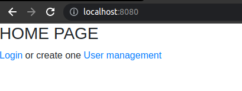
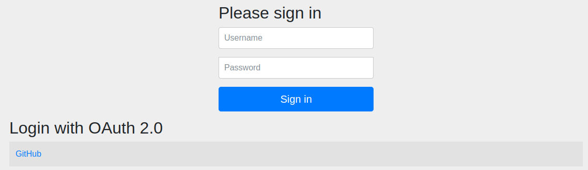
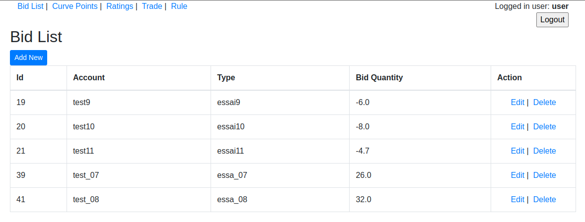
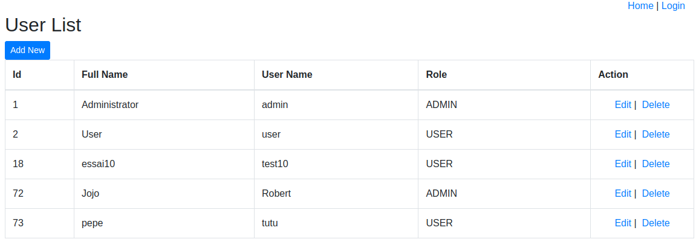

# Projet P7 : Poseidon.inc

## Table of Contents
* [Presentation](#presentation)
* [Technologies Used](#technologies-used)
* [SQL Script](#SQL-Script)
* [database connection](#database-connection)
* [Code layout](#code-layout)
* [The back end](#The-back-end)
* [Test](#Test)
* [For more details](#more-details)
* [Acknowledgements](#acknowledgements)
* [Contact](#contact)

## presentation
 enterprise software deployed on the web to generate more transactions for investors
.

Authentication with github token:
.

user or admin authentication gives access to the main page:
.

Only the administrator has access to the user creation / modification or deletion page: 
.

## Technologies Used
- Java - version 11.0
- HTML
- CSS - version 3.0
- Mysql /Sql

## #SQL-Script
Creation of the database, and tables :

## database-connection
In order to secure the application, we have decided not to include the password in the properties file: 

the identifier and password are saved in the arguments of the execution of the application :
- in the  Eclipse IDE:
right click on the app -> run as / run configuration / argument tab, in the program argument field, enter:

--spring.datasource.username=myident--spring.datasource.password=mypassword

With maven command line :

mvn spring-boot:run -Dspring-boot.run.arguments="--spring.datasource.username=myident --spring.datasource.password=mypassword"

## code-layout
The back end (in spring) is in src/main/java
Front end is in src/main/ressources

## The back end
The back-end part of the application is based on the Model Vue Controller model.

controllers forward requests from the front-end to the back-end and 
the controllers transmit the requests coming from the front-end to the back-end and feed their result from the back-end to the front-end

the "view" class is the entry point of the web application.

## Test
overall test coverage: 82%

## more-details
More details on my P7 presentation pdf:

## Acknowledgements
- Many thanks to my mentor Pierre FOUCHET who gave me great help, especially on the front-end part

## Contact
Created by [@olivtopa] - feel free to contact me!